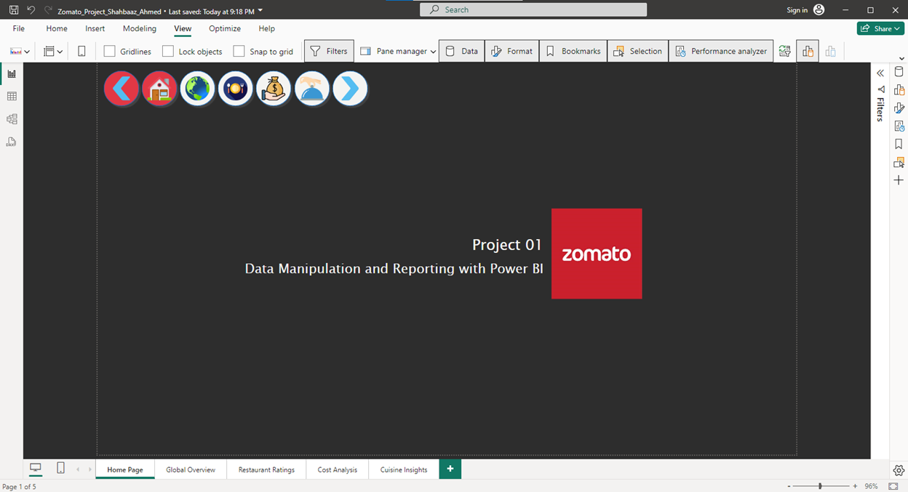
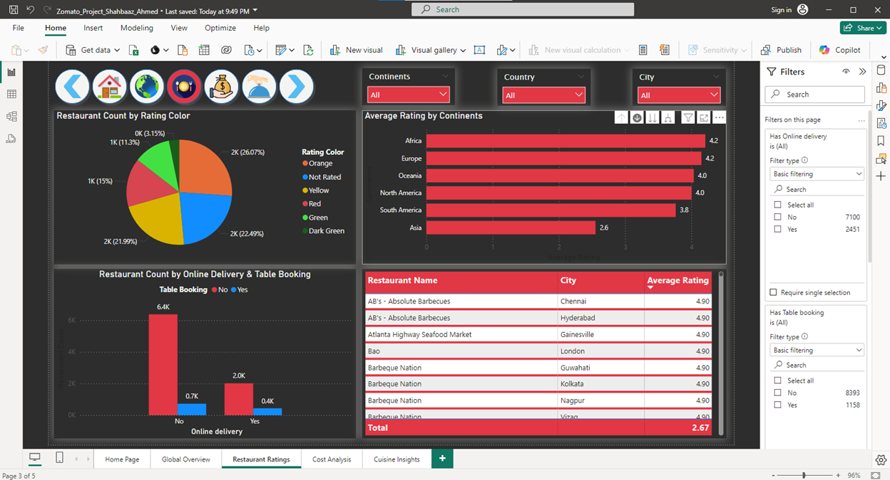
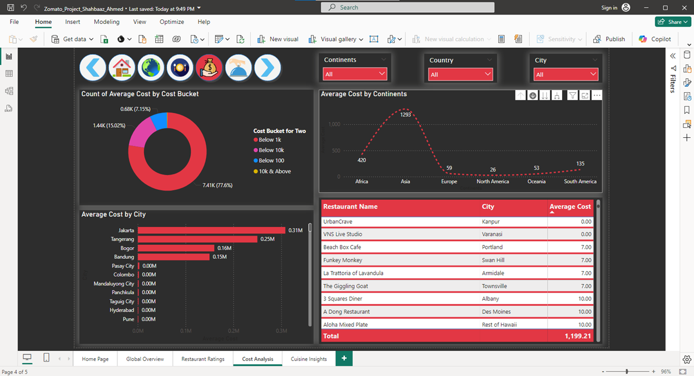
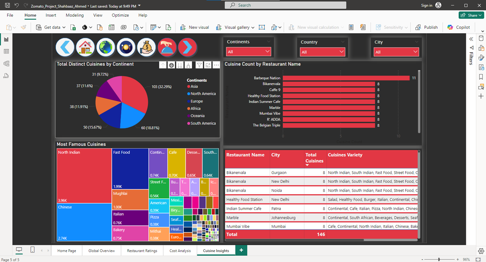

# 🍴 Zomato-PowerBI-Project
Power BI project analyzing Zomato restaurant data across regions

## 📌 Project Overview

This project analyzes Zomato’s global restaurant data using **Power BI**. The objective was to build an **interactive multi-page dashboard** that helps identify business performance patterns such as restaurant availability, cost, ratings, cuisines, and service offerings across different regions.

The dashboard provides actionable insights for Zomato’s stakeholders to evaluate performance at both global and regional levels.

---

## 🎯 Objectives

* Derive total restaurant count worldwide (continent, country, and city level).
* Highlight restaurants with the highest ratings and lowest average costs.
* Visualize cuisine diversity across regions.
* Analyze service availability (online delivery, table booking).
* Create an **interactive multi-page report** with filters and drill-down features.
* Present the dashboard in line with **Zomato’s branding**.

---

## 📂 Repository Structure

```
├── datasets/                     # Input datasets (Excel files)  
├── Images/                       # Icon images used in the report  
├── Zomato PowerBI Dashboard.pbix # Main Power BI project file  
├── Zomato Project Screenshot.pdf # Screenshots of all report pages with steps  
├── Zomato Brand Guidelines.pdf   # Branding reference for visuals  
└── README.md                     # Project documentation  
```

---

## 📊 Dashboard Pages

1. **Global Overview** – KPIs, world map, restaurant counts
2. **Restaurant Ratings** – Highest/lowest ratings, distribution by region
3. **Cost Analysis** – Average costs, expensive vs affordable restaurants
4. **Cuisine Insights** – Cuisine variety, popularity by region
5. **Summary Dashboard** – Consolidated KPIs and key visuals

---

## 🛠️ Key Features & Techniques

* **Power Query**: Data cleaning, merging multiple continent files, transformations
* **DAX**: Created calculated measures (Restaurant Count, Average Rating, Average Cost, Cuisine Count)
* **Hierarchies**: Continent → Country → City drill-down for geographical analysis
* **Custom Visuals**: KPI Cards, Combo Chart, Map, Donut Chart, Treemap
* **Branding**: Colors, icons, and fonts aligned with **Zomato’s brand guidelines**

---

## 📸 Dashboard Preview  

Here are some sample pages from the dashboard:  

### 📑 Home Page  
  

### 🌍 Global Overview  
  

### ⭐ Restaurant Ratings  
  

### 💰 Cost Analysis  
  

### 🍽 Cuisine Insights  
  

For full details, see **Zomato Project Screenshot.pdf** in this repository.  


---

## 🚀 How to Use

1. Download the repository or clone it:

   ```bash
   git clone https://github.com/yourusername/Zomato-PowerBI-Project.git
   ```
2. Open **Zomato PowerBI Dashboard.pbix** in **Power BI Desktop**.
3. Explore the multi-page report with interactive filters and drill-down options.

---

## 📈 Learnings

Through this project, I strengthened my skills in:

* Power Query for advanced data transformations
* DAX for creating measures and calculated columns
* Designing professional, multi-page dashboards
* Applying corporate branding to data visualizations
* Building interactive, drillable reports for real-world business cases

---

## 🙌 Acknowledgments

This project is inspired by Zomato’s global operations and was built as part of my **Power BI learning journey**.
